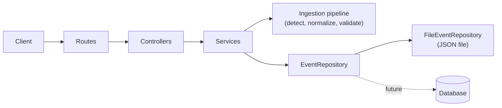

# Backend Architecture

The backend is a TypeScript + Express service built on a **Unified-Event architecture**:
every kind of clinical event is converted into one canonical model, `UnifiedEvent`
([UnifiedEvents.ts](../src/types/UnifiedEvents.ts)), and everything downstream
(validation, storage, queries, API responses) works only with that model.

## Layers

| Layer | Directory | Responsibility |
|-------|-----------|----------------|
| Routes | `src/routes/` | Map URLs to controllers |
| Controllers | `src/controllers/` | HTTP concerns only: read the request, choose a status code |
| Services | `src/services/` | Business logic: ingestion, validation, persistence, query, batch |
| Ingestion | `src/ingestion/` | Event-type detection |
| Normalizers | `src/normalizers/` | Pure raw-record to `UnifiedEvent` conversion, plus the registry |
| Schemas | `src/schemas/` | Runtime validation (zod) for events, queries and batches |
| Persistence | `src/persistence/` | `EventRepository` interface, query logic, file implementation |
| Middleware | `src/middleware/` | Error handling |

Dependencies point downward only: controllers never touch storage directly, and normalizers
know nothing about HTTP or storage.

## Key design rules

- **`UnifiedEvent` is the single source of truth.** See the [specification](../src/schemas/UnifiedEventSpec.md).
- **Normalizers are pure**: no I/O, no mutation of input, always return a complete event.
- **Raw input is source-agnostic.** `RawEventRecord` is `{ id, fields }`; field names such as
  `Event_Type` and `Event_UID` are the ingestion contract, not a dependency on any external system.
- **`uid` is the identity.** Saving an existing `uid` replaces the event, which makes retries safe.
- **Dependency injection at the edge.** `createApp({ repository })` receives the storage
  implementation, so tests use temporary stores and a database can replace the file store
  without touching other layers.
- **Fail loudly, never silently.** Unknown query parameters, unknown event fields, and corrupt
  stores are errors, not ignored input.

## Error handling

Services throw `HttpError(status, message, details?)`; the error handler in
[errorHandler.ts](../src/middleware/errorHandler.ts) turns it into `{ error, details? }`.
Malformed JSON is 400, oversized bodies are 413, and anything unexpected is a generic 500 with
no internal details (the real error is logged).

## Known limitations

- **No authentication or authorization.** All endpoints, including queries over patient data, are open.
  This must be addressed before deployment or before a frontend connects outside local development.
- **CORS is open to all origins** (`cors()` with defaults).
- **File store scales poorly.** Every operation reads or rewrites the whole file; a database
  implementation of `EventRepository` is the intended path for real volumes.
- **No history.** Re-ingesting a `uid` overwrites the previous event; there is no versioning
  or audit trail.
- **Single process.** The file store serializes writes within one process only; do not run
  several instances against the same file.
- **The store holds patient data.** `backend/data/` is git-ignored; keep it that way.

## Related docs

[Ingestion pipeline](./ingestion-pipeline.md) ·
[Normalizer registry](./normalizer-registry.md) ·
[API reference](./api.md) ·
[UnifiedEvent specification](../src/schemas/UnifiedEventSpec.md)
