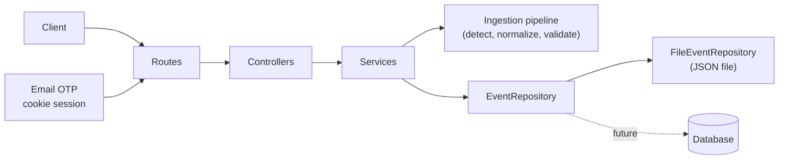

# Backend Architecture

The backend is a TypeScript + Express service built on a **Unified-Event architecture**:
every kind of clinical event is converted into one canonical model, `UnifiedEvent`
([UnifiedEvents.ts](../src/types/UnifiedEvents.ts)), and everything downstream
(validation, storage, queries, API responses) works only with that model.

## Layers

| Layer | Directory | Responsibility |
|-------|-----------|----------------|
| Routes | `src/routes/` | Map URLs to controllers |
| Controllers | `src/controllers/` | HTTP concerns only: read the request, choose a status code |
| Services | `src/services/` | Business logic: ingestion, validation, persistence, query, batch |
| Ingestion | `src/ingestion/` | Event-type detection |
| Normalizers | `src/normalizers/` | Pure raw-record to `UnifiedEvent` conversion, plus the registry |
| Schemas | `src/schemas/` | Runtime validation (zod) for events, queries and batches |
| Persistence | `src/persistence/` | `EventRepository` interface, query logic, file implementation |
| Middleware | `src/middleware/` | Error handling |
| Auth | `src/auth/` | Email OTP, account/invite/session storage, SMTP adapter, origin and role checks |

Dependencies point downward only: controllers never touch storage directly, and normalizers
know nothing about HTTP or storage.

## Key design rules

- **`UnifiedEvent` is the single source of truth.** See the [specification](../src/schemas/UnifiedEventSpec.md).
- **Normalizers are pure**: no I/O, no mutation of input, always return a complete event.
- **Raw input is source-agnostic.** `RawEventRecord` is `{ id, fields }`; field names such as
  `Event_Type` and `Event_UID` are the ingestion contract, not a dependency on any external system.
- **`uid` is the identity.** Saving an existing `uid` replaces the event, which makes retries safe.
- **Dependency injection at the edge.** `createApp({ repository })` receives the storage
  implementation, so tests use temporary stores and a database can replace the file store
  without touching other layers.
- **Fail loudly, never silently.** Unknown query parameters, unknown event fields, and corrupt
  stores are errors, not ignored input.
- **Backend authorization is authoritative.** Event routes require a live session and apply the role rules below.
- **No event deletion.** Corrections are represented as new or updated events; submitted history is not deleted.

## Identity and access

| Role | Read events | Create/edit events | Scope |
|------|-------------|--------------------|-------|
| `administrator` | All | All | All patient records |
| `clinical` | All | No | All patient records |
| `patient` | Own | Own | The `masterId` bound to the account |

Patient writes have their `masterId` replaced with the account's linked identifier.
The repository atomically rejects cross-patient uid replacement. Patient queries are
server-scoped, and attempts to read another patient's event return 404. Event deletion
is not provided for any role.

Patients self-register with an administrator-issued, single-use, seven-day invite.
Administrators and clinical users are provisioned by an administrator. The first
administrator is established with `ADMIN_BOOTSTRAP_SECRET`, then must verify a code
sent to their email. OTPs are six digits, HMAC-hashed at rest, valid for 10 minutes,
invalidated after five failed attempts, and subject to resend/IP throttles.

Sessions are random opaque bearer values; only their HMAC hashes are stored. Cookies
are HttpOnly and SameSite=Lax, Secure in production, expire after 12 hours, and are
invalidated after 30 minutes idle. Unsafe requests carrying an Origin must match the
configured `FRONTEND_ORIGIN`; CORS credentials are limited to that origin.

## Error handling

Services throw `HttpError(status, message, details?)`; the error handler in
[errorHandler.ts](../src/middleware/errorHandler.ts) turns it into `{ error, details? }`.
Malformed JSON is 400, oversized bodies are 413, and anything unexpected is a generic 500 with
no internal details (the real error is logged).

## Known limitations

- **SMTP must be configured for sign-in.** Without a provider, OTP requests fail with 503; the app never logs a code.
- **SMTP transport is TLS-only.** Configure the provider submission host and verified sender; port 587 requires STARTTLS and port 465 uses implicit TLS.
- **File auth and event stores are single-process only.** They serialize within a process, not across multiple server instances.
- **No external identity provider or account recovery.** Email OTP is the only login method for the MVP.
- **No event deletion or audit log.** Upserts replace a matching uid; correction/version history is not yet implemented.
- **Analytics are not implemented.** When added, minimum cohort size and inference protections must be enforced server-side.
- **File store scales poorly.** Every operation reads or rewrites the whole file; a database
  implementation of `EventRepository` is the intended path for real volumes.
- **The store holds patient data.** `backend/data/` is git-ignored; keep it that way.

## Related docs

[Ingestion pipeline](./ingestion-pipeline.md) ·
[Normalizer registry](./normalizer-registry.md) ·
[API reference](./api.md) ·
[UnifiedEvent specification](../src/schemas/UnifiedEventSpec.md)
