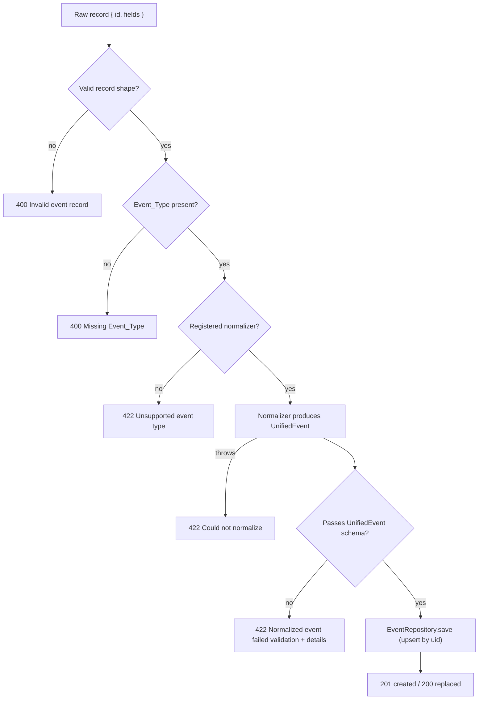

# Ingestion Pipeline

Both `POST /api/events/ingest` and `POST /api/events/batch` run each record through the same
function, `ingestEvent` ([ingestionService.ts](../src/services/ingestionService.ts)), and then store it.

## Steps

1. **Shape check** ([rawEventRecordSchema.ts](../src/schemas/rawEventRecordSchema.ts)): `id` is a non-empty string and `fields` is an object.
2. **Detect type** ([detectEventType.ts](../src/ingestion/detectEventType.ts)): reads `fields.Event_Type`, trimmed. Empty or non-string means missing.
3. **Select normalizer**: looked up by exact name in the [registry](./normalizer-registry.md). Only the registry's own keys count, so inherited names such as `toString` or `__proto__` are rejected as unsupported.
4. **Normalize**: the normalizer builds a `UnifiedEvent`. If it throws (for example a generic `Treatment` record that matches no subtype), the failure is reported as 422, not 500.
5. **Validate** ([unifiedEventSchema.ts](../src/schemas/unifiedEventSchema.ts)): the normalized event must satisfy the strict schema. Validation runs on the *output*, so a normalizer bug cannot write a malformed event.
6. **Persist**: `EventRepository.save` upserts by `uid`. New events return 201, replaced ones 200.

Nothing is written unless every earlier step succeeds.

## Identity and required fields

| Event field | Comes from | Fallback |
|-------------|-----------|----------|
| `uid` | `Event_UID` | the record `id` |
| `masterId` | `Master_ID` | none; an empty value fails validation |
| `eventDate` | `Event_Date` | `null` (allowed) |

Because `uid` falls back to the record `id`, records without `Event_UID` are still idempotent
as long as the `id` is stable.

## Batch behavior

[`ingestBatch`](../src/services/batchIngestionService.ts) runs the steps above per record, in
order. A failure affects only its own record and is reported by `index`; valid records are
saved. Unexpected storage errors are reported as `Storage error` without internal detail. A batch
is not atomic, but because saves are upserts, resending the whole batch or only its failures is safe.

## Extending the pipeline

To support a new event type, add a normalizer and register it (see the
[registry guide](./normalizer-registry.md)). Add any new `UnifiedEvent` fields to both the
interface and the schema; the registry round-trip test fails if they disagree.
