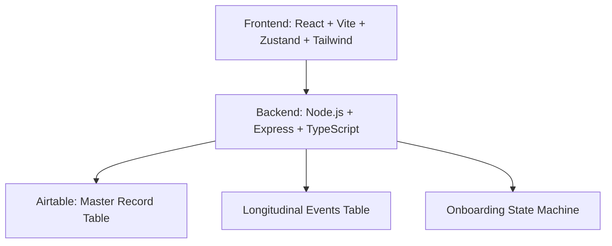

```md
EVP First Platform Architecture

## Overview
The EVP First platform is a full‑stack registry system designed to support identity creation, onboarding, structured patient data collection, longitudinal event tracking, and analytics. The architecture is intentionally modular, enabling future expansion into surveys, dashboards, and clinical data pipelines.

## System Diagram


Backend Architecture (Node.js + Express + TypeScript)
Structure
/backend/src/app.ts — Express app initialization
/backend/src/routes — API routes (identity, onboarding, patient forms)
/backend/src/services — business logic (Airtable sync, onboarding state machine)
/backend/src/models — TypeScript interfaces for master record + onboarding states
/backend/src/utils — helpers (validation, logging, error handling)

Key Modules
Identity Module
POST /check-email

POST /create-account

Passkey enrollment (future)

Invitation flow (future)

Onboarding Module
State machine:
UNSTARTED → PROFILE → CONSENT → BASELINE → COMPLETE
Transition rules enforced in service layer
Stored in Airtable master record

Patient Data Pipeline
POST /patient-form

Normalizes incoming form data

Writes to Airtable master record

Generates longitudinal event entries

Airtable Integration
Master record table

Longitudinal event table

Sync rules defined in service layer

API key stored in environment variables

Frontend Architecture (Vite + React + Router + Zustand + Tailwind)
Structure
/frontend/src/main.tsx — app bootstrap
/frontend/src/routes — page-level routing
/frontend/src/components — shared UI components
/frontend/src/state — Zustand stores
/frontend/src/api — Axios API client
/frontend/src/styles — Tailwind configuration

Key Modules
Identity & Onboarding UI
Email check

Account creation

Onboarding stepper

Consent screens

Baseline questionnaire

Patient Form UI
Dynamic form components

Validation

Submission to backend

Admin Dashboard (future)
Invitation management

Passkey enrollment

Longitudinal event grid

Data Flow
Identity Flow
User enters email

Frontend calls POST /check-email

Backend checks Airtable for existing record

Backend returns:

EXISTS → login or resume onboarding

NEW → create account

Onboarding state machine begins

Patient Data Flow
User submits form

Frontend sends JSON payload

Backend normalizes fields

Backend updates Airtable master record

Backend appends longitudinal event entry

Frontend receives confirmation

Airtable Schema
Master Record Table
record_id

email

first_name

last_name

onboarding_state

consent_signed

baseline_complete

created_at

updated_at

Longitudinal Events Table
event_id

record_id

event_type

payload

timestamp

Security Architecture
HTTPS enforced

API keys stored in environment variables

No PHI stored locally

Airtable access restricted by role

Passkey enrollment planned for identity hardening

Backend validation for all incoming payloads

Rate limiting planned for public endpoints

Roadmap Integration
This architecture supports the following milestones:

Identity & Onboarding

Patient Data Pipeline

Frontend Scaffolding

Admin Dashboard

Survey Module

Analytics & Reporting
