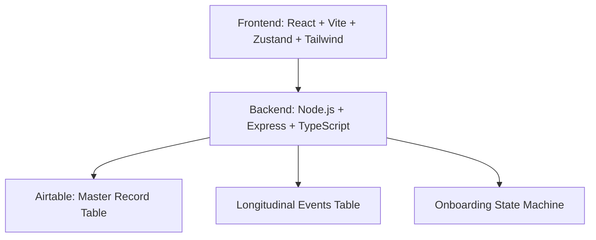

```mermaid
flowchart TD
    A[Frontend: React + Vite + Zustand + Tailwind] --> B[Backend: Node.js + Express + TypeScript]
    B --> C[Airtable: Master Record Table]
    B --> D[Longitudinal Events Table]
    B --> E[Onboarding State Machine]
```